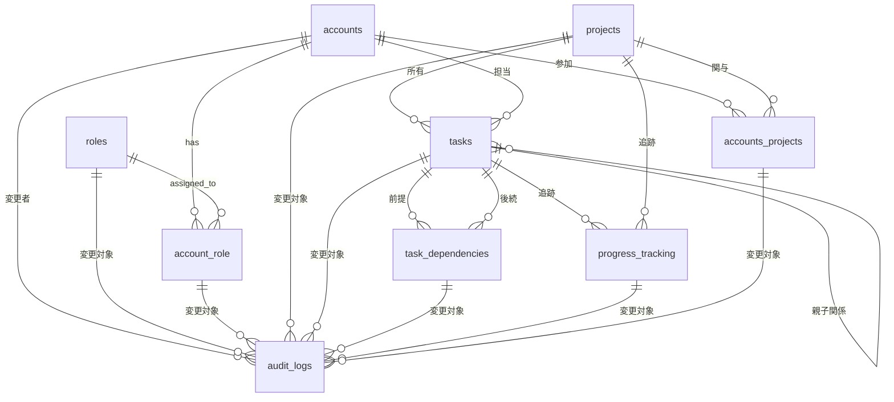

# Database Design

## Entity-Relationship Diagram (ERD)



## Table Description

### `BaseModel`

| カラム名   | データ型 | NULL 許可 | デフォルト値 | 制約 | 説明                                   |
| ---------- | -------- | --------- | ------------ | ---- | -------------------------------------- |
| id         | UUID     | NOT NULL  | -            | PK   | レコードの一意識別子                   |
| created_at | DateTime | NOT NULL  | CURRENT_TIME | -    | 作成日時                               |
| updated_at | DateTime | NOT NULL  | CURRENT_TIME | -    | 更新日時                               |
| deleted_at | DateTime | NULL      | -            | -    | 削除日時 (削除されていない場合は NULL) |

### `accounts`

| カラム名 | データ型     | NULL 許可 | デフォルト値 | 制約   | 説明                     |
| -------- | ------------ | --------- | ------------ | ------ | ------------------------ |
| name     | VARCHAR(255) | NOT NULL  | -            | -      | アカウント名             |
| email    | VARCHAR(255) | NOT NULL  | -            | UNIQUE | メールアドレス           |
| password | VARCHAR(255) | NOT NULL  | -            | -      | パスワード（ハッシュ化） |

### `roles`

| カラム名    | データ型    | NULL 許可 | デフォルト値 | 制約   | 説明           |
| ----------- | ----------- | --------- | ------------ | ------ | -------------- |
| name        | VARCHAR(50) | NOT NULL  | -            | UNIQUE | 役割名         |
| description | TEXT        | NULL      | -            | -      | 役割の説明     |
| permissions | JSON        | NULL      | -            | -      | 役割の権限設定 |

### `account_role`

| カラム名   | データ型 | NULL 許可 | デフォルト値 | 制約            | 説明                         |
| ---------- | -------- | --------- | ------------ | --------------- | ---------------------------- |
| account_id | UUID     | NOT NULL  | -            | FK(accounts.id) | アカウントテーブルの外部キー |
| role_id    | UUID     | NOT NULL  | -            | FK(roles.id)    | 役割テーブルの外部キー       |

### `projects`

| カラム名    | データ型     | NULL 許可 | デフォルト値 | 制約 | 説明               |
| ----------- | ------------ | --------- | ------------ | ---- | ------------------ |
| name        | VARCHAR(255) | NOT NULL  | -            | -    | プロジェクト名     |
| description | TEXT         | NULL      | -            | -    | プロジェクトの説明 |
| start_date  | DATE         | NULL      | -            | -    | 開始日             |
| end_date    | DATE         | NULL      | -            | -    | 終了日             |

### `accounts_projects`

| カラム名        | データ型    | NULL 許可 | デフォルト値 | 制約                           | 説明                                           |
| --------------- | ----------- | --------- | ------------ | ------------------------------ | ---------------------------------------------- |
| account_id      | UUID        | NOT NULL  | -            | FK(accounts.id)                | アカウントテーブルの外部キー                   |
| project_id      | UUID        | NOT NULL  | -            | FK(projects.id)                | プロジェクトテーブルの外部キー                 |
| role_in_project | VARCHAR(50) | NOT NULL  | 'member'     | -                              | プロジェクト内での役割 (owner, member, viewer) |
| joined_at       | DateTime    | NOT NULL  | CURRENT_TIME | -                              | プロジェクト参加日時                           |
| is_active       | Boolean     | NOT NULL  | true         | -                              | 参加状態 (true=アクティブ, false=非アクティブ) |
| -               | -           | -         | -            | UNIQUE(account_id, project_id) | 重複参加防止                                   |

### `tasks`

| カラム名    | データ型     | NULL 許可 | デフォルト値  | 制約                                   | 説明                                                                       |
| ----------- | ------------ | --------- | ------------- | -------------------------------------- | -------------------------------------------------------------------------- |
| title       | VARCHAR(255) | NOT NULL  | -             | -                                      | タスク名                                                                   |
| description | TEXT         | NULL      | -             | -                                      | タスクの説明                                                               |
| status      | ENUM         | NOT NULL  | 'not_started' | -                                      | ステータス (not_started, in_progress, in_review, done, on_holed, canceled) |
| level       | INTEGER      | NOT NULL  | 1             | CHECK(level >= 1 AND level <= 10)      | 階層レベル (1=タスク, 2=サブタスク, 3=サブサブタスク)                      |
| parent_id   | UUID         | NULL      | -             | FK(tasks.id)                           | 親タスクの ID (nullable)                                                   |
| priority    | INTEGER      | NOT NULL  | 3             | CHECK(priority >= 1 AND priority <= 5) | 優先度 (1-5)                                                               |
| project_id  | UUID         | NOT NULL  | -             | FK(projects.id)                        | プロジェクトテーブルの外部キー                                             |
| assigned_to | UUID         | NULL      | -             | FK(accounts.id)                        | 担当者アカウントテーブルの外部キー                                         |

### `task_dependencies`

| カラム名        | データ型    | NULL 許可 | デフォルト値 | 制約                                               | 説明                              |
| --------------- | ----------- | --------- | ------------ | -------------------------------------------------- | --------------------------------- |
| predecessor_id  | UUID        | NOT NULL  | -            | FK(tasks.id)                                       | 前提タスクの ID (外部キー)        |
| successor_id    | UUID        | NOT NULL  | -            | FK(tasks.id)                                       | 後続タスクの ID (外部キー)        |
| dependency_type | VARCHAR(10) | NOT NULL  | 'FS'         | CHECK(dependency_type IN ('FS', 'SS', 'FF', 'SF')) | 依存関係のタイプ (FS, SS, FF, SF) |
| -               | -           | -         | -            | UNIQUE(predecessor_id, successor_id)               | 重複依存関係防止                  |

### `progress_tracking`

| カラム名            | データ型     | NULL 許可 | デフォルト値 | 制約                                                                                                | 説明                                           |
| ------------------- | ------------ | --------- | ------------ | --------------------------------------------------------------------------------------------------- | ---------------------------------------------- |
| task_id             | UUID         | NULL      | -            | FK(tasks.id)                                                                                        | タスクテーブルの外部キー (nullable)            |
| project_id          | UUID         | NULL      | -            | FK(projects.id)                                                                                     | プロジェクトテーブルの外部キー (nullable)      |
| trackable_type      | VARCHAR(10)  | NOT NULL  | -            | CHECK(trackable_type IN ('task', 'project'))                                                        | 追跡対象のタイプ (task, project)               |
| progress_percentage | DECIMAL(5,2) | NOT NULL  | 0.00         | CHECK(progress_percentage >= 0 AND progress_percentage <= 100)                                      | 進捗率 (0-100)                                 |
| estimated_hours     | DECIMAL(8,2) | NULL      | -            | CHECK(estimated_hours >= 0)                                                                         | 予定工数                                       |
| actual_hours        | DECIMAL(8,2) | NULL      | -            | CHECK(actual_hours >= 0)                                                                            | 実績工数                                       |
| planned_start_date  | DATE         | NULL      | -            | -                                                                                                   | 予定開始日                                     |
| planned_end_date    | DATE         | NULL      | -            | -                                                                                                   | 予定終了日                                     |
| actual_start_date   | DATE         | NULL      | -            | -                                                                                                   | 実績開始日                                     |
| actual_end_date     | DATE         | NULL      | -            | -                                                                                                   | 実績終了日                                     |
| -                   | -            | -         | -            | CHECK((task_id IS NOT NULL AND project_id IS NULL) OR (task_id IS NULL AND project_id IS NOT NULL)) | タスクかプロジェクトのどちらか一方のみ設定可能 |

### `audit_logs`

| カラム名   | データ型    | NULL 許可 | デフォルト値 | 制約                                            | 説明                                          |
| ---------- | ----------- | --------- | ------------ | ----------------------------------------------- | --------------------------------------------- |
| table_name | VARCHAR(50) | NOT NULL  | -            | -                                               | 対象テーブル名                                |
| record_id  | UUID        | NOT NULL  | -            | -                                               | 対象レコードの ID                             |
| action     | VARCHAR(10) | NOT NULL  | -            | CHECK(action IN ('INSERT', 'UPDATE', 'DELETE')) | 実行されたアクション (INSERT, UPDATE, DELETE) |
| old_value  | JSON        | NULL      | -            | -                                               | 変更前の値 (更新時のみ)                       |
| new_value  | JSON        | NULL      | -            | -                                               | 変更後の値 (更新時のみ)                       |
| changed_by | UUID        | NOT NULL  | -            | FK(accounts.id)                                 | 変更を行ったユーザーのアカウント ID           |
| changed_at | DateTime    | NOT NULL  | CURRENT_TIME | -                                               | 変更日時                                      |

## プロジェクトの予実管理設計

### 管理レベル

1. **プロジェクトレベル**

   - プロジェクト全体の予実管理
   - `progress_tracking` テーブルで `trackable_type = 'project'`

2. **タスクレベル**
   - 個別タスクの予実管理
   - `progress_tracking` テーブルで `trackable_type = 'task'`

### 使用例

#### プロジェクトの予実登録

```sql
-- プロジェクトの予定工数登録
INSERT INTO progress_tracking (
    project_id, trackable_type, estimated_hours,
    planned_start_date, planned_end_date
) VALUES (
    'project-123', 'project', 1000.0,
    '2025-01-01', '2025-06-30'
);
```

#### 集計クエリ例

```sql
-- プロジェクトの予定工数合計
SELECT
    p.name AS project_name,
    SUM(tt.estimated_hours) AS total_estimated_hours,
    SUM(tt.actual_hours) AS total_actual_hours
FROM projects p
LEFT JOIN progress_tracking tt ON p.id = tt.project_id
WHERE tt.trackable_type = 'project'
GROUP BY p.id, p.name;
```

## パフォーマンス最適化の提案

### 推奨インデックス

```sql
-- 頻繁に使用される検索条件用のインデックス
CREATE INDEX idx_accounts_email ON accounts(email);
CREATE INDEX idx_accounts_deleted_at ON accounts(deleted_at);
CREATE INDEX idx_tasks_project_status ON tasks(project_id, status) WHERE deleted_at IS NULL;
CREATE INDEX idx_tasks_assigned_to ON tasks(assigned_to) WHERE deleted_at IS NULL;
CREATE INDEX idx_tasks_parent_id ON tasks(parent_id) WHERE deleted_at IS NULL;
CREATE INDEX idx_progress_tracking_task_id ON progress_tracking(task_id) WHERE deleted_at IS NULL;
CREATE INDEX idx_progress_tracking_project_id ON progress_tracking(project_id) WHERE deleted_at IS NULL;
CREATE INDEX idx_audit_logs_table_record ON audit_logs(table_name, record_id);
CREATE INDEX idx_audit_logs_changed_at ON audit_logs(changed_at);

-- 複合インデックス
CREATE INDEX idx_accounts_projects_active ON accounts_projects(account_id, project_id, is_active);
CREATE INDEX idx_task_dependencies_predecessor ON task_dependencies(predecessor_id);
CREATE INDEX idx_task_dependencies_successor ON task_dependencies(successor_id);
```

### パーティショニング提案

```sql
-- audit_logsテーブルの日付パーティショニング
CREATE TABLE audit_logs (
    -- カラム定義
) PARTITION BY RANGE (changed_at);

-- 月別パーティション例
CREATE TABLE audit_logs_2025_01 PARTITION OF audit_logs
FOR VALUES FROM ('2025-01-01') TO ('2025-02-01');
```

## データ整合性・制約の強化

### 追加制約の提案

```sql
-- 日付の論理チェック
ALTER TABLE projects ADD CONSTRAINT chk_project_dates
CHECK (start_date IS NULL OR end_date IS NULL OR start_date <= end_date);

ALTER TABLE progress_tracking ADD CONSTRAINT chk_progress_dates
CHECK (planned_start_date IS NULL OR planned_end_date IS NULL OR planned_start_date <= planned_end_date);

-- 循環参照防止（タスクの親子関係）
CREATE OR REPLACE FUNCTION check_task_hierarchy() RETURNS TRIGGER AS $$
BEGIN
    IF NEW.parent_id IS NOT NULL THEN
        -- 自分自身を親にすることを防止
        IF NEW.id = NEW.parent_id THEN
            RAISE EXCEPTION '自分自身を親タスクにすることはできません';
        END IF;
        -- 循環参照をチェック（簡単な例）
        -- 実際の実装では再帰的チェックが必要
    END IF;
    RETURN NEW;
END;
$$ LANGUAGE plpgsql;

CREATE TRIGGER trg_check_task_hierarchy
    BEFORE INSERT OR UPDATE ON tasks
    FOR EACH ROW EXECUTE FUNCTION check_task_hierarchy();
```

### ビジネスルール制約

```sql
-- プロジェクトにはオーナーが必要
CREATE OR REPLACE FUNCTION ensure_project_owner() RETURNS TRIGGER AS $$
BEGIN
    IF NOT EXISTS (
        SELECT 1 FROM accounts_projects
        WHERE project_id = NEW.id AND role_in_project = 'owner' AND is_active = true
    ) THEN
        RAISE EXCEPTION 'プロジェクトには最低1人のオーナーが必要です';
    END IF;
    RETURN NEW;
END;
$$ LANGUAGE plpgsql;
```

## セキュリティ強化の提案

### 1. **パスワード管理**

```sql
-- accountsテーブルの拡張
ALTER TABLE accounts ADD COLUMN password_hash VARCHAR(255);
ALTER TABLE accounts ADD COLUMN password_salt VARCHAR(255);
ALTER TABLE accounts ADD COLUMN last_password_change TIMESTAMP;
ALTER TABLE accounts ADD COLUMN failed_login_attempts INTEGER DEFAULT 0;
ALTER TABLE accounts ADD COLUMN locked_until TIMESTAMP;
```

### 2. **認証・認可の強化**

```sql
-- セッション管理テーブル
CREATE TABLE user_sessions (
    id UUID PRIMARY KEY DEFAULT gen_random_uuid(),
    account_id UUID NOT NULL REFERENCES accounts(id),
    session_token VARCHAR(255) NOT NULL UNIQUE,
    expires_at TIMESTAMP NOT NULL,
    created_at TIMESTAMP DEFAULT CURRENT_TIMESTAMP,
    last_activity TIMESTAMP DEFAULT CURRENT_TIMESTAMP,
    ip_address INET,
    user_agent TEXT
);

-- API キー管理
CREATE TABLE api_keys (
    id UUID PRIMARY KEY DEFAULT gen_random_uuid(),
    account_id UUID NOT NULL REFERENCES accounts(id),
    key_name VARCHAR(100) NOT NULL,
    key_hash VARCHAR(255) NOT NULL,
    permissions JSON,
    expires_at TIMESTAMP,
    last_used_at TIMESTAMP,
    created_at TIMESTAMP DEFAULT CURRENT_TIMESTAMP
);
```

### 3. **Row Level Security（RLS）**

```sql
-- RLSの有効化
ALTER TABLE tasks ENABLE ROW LEVEL SECURITY;
ALTER TABLE projects ENABLE ROW LEVEL SECURITY;

-- プロジェクトメンバーのみアクセス可能
CREATE POLICY project_access_policy ON projects
    USING (id IN (
        SELECT project_id FROM accounts_projects
        WHERE account_id = current_user_id() AND is_active = true
    ));
```

## スケーラビリティとメンテナンス性

### 1. **アーカイブ戦略**

```sql
-- 完了したプロジェクトのアーカイブ
CREATE TABLE archived_projects (
    LIKE projects INCLUDING ALL
);

-- 定期的なアーカイブ処理
CREATE OR REPLACE FUNCTION archive_completed_projects() RETURNS VOID AS $$
BEGIN
    INSERT INTO archived_projects
    SELECT * FROM projects
    WHERE end_date < CURRENT_DATE - INTERVAL '1 year'
    AND NOT EXISTS (
        SELECT 1 FROM tasks WHERE project_id = projects.id AND status != 'completed'
    );
END;
$$ LANGUAGE plpgsql;
```

### 2. **データ圧縮・パーティショニング**

```sql
-- 時系列データのパーティショニング
CREATE TABLE audit_logs_monthly (
    LIKE audit_logs INCLUDING ALL
) PARTITION BY RANGE (changed_at);

-- 自動パーティション作成
CREATE EXTENSION IF NOT EXISTS pg_partman;
```

### 3. **監視・メトリクス**

```sql
-- パフォーマンス監視用ビュー
CREATE VIEW performance_metrics AS
SELECT
    'projects' as table_name,
    COUNT(*) as total_records,
    COUNT(*) FILTER (WHERE deleted_at IS NULL) as active_records,
    MAX(updated_at) as last_updated
FROM projects
UNION ALL
SELECT
    'tasks' as table_name,
    COUNT(*) as total_records,
    COUNT(*) FILTER (WHERE deleted_at IS NULL) as active_records,
    MAX(updated_at) as last_updated
FROM tasks;
```

## 🔴 **注意すべきリスク**

### 1. **複雑性の管理**

- 多くのテーブルと関係により、クエリが複雑になる可能性
- 開発チームの理解コストが高い

### 2. **パフォーマンス**

- JOIN 操作が多くなる傾向
- 論理削除により、データ量が増加

### 3. **データ整合性**

- 複雑な制約により、データ更新時の注意が必要
- 階層構造の深い参照による循環参照リスク

## 🚀 **次のステップ**

1. **プロトタイプ作成**: 小規模データでの動作確認
2. **負荷テスト**: 想定データ量でのパフォーマンス検証
3. **セキュリティ監査**: 権限管理の妥当性確認
4. **バックアップ戦略**: 災害復旧計画の策定
5. **移行計画**: 既存システムからの移行戦略
