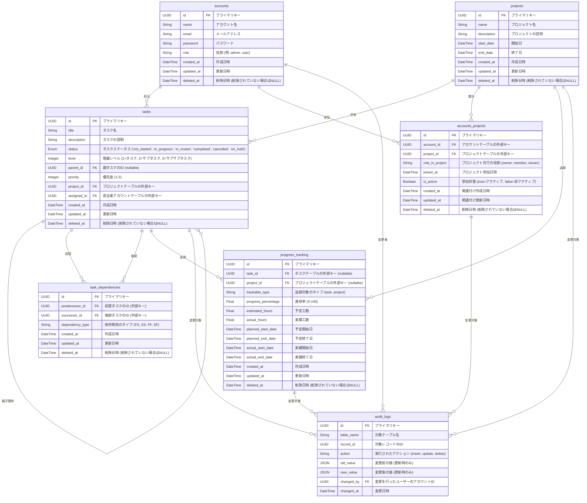

# Database Design

## Entity-Relationship Diagram (ERD)



## Table Description

### ベースモデル: `BaseModel`

| カラム名   | データ型 | 説明                                   |
| ---------- | -------- | -------------------------------------- |
| id         | UUID     | レコードの一意識別子                   |
| created_at | DateTime | 作成日時                               |
| updated_at | DateTime | 更新日時                               |
| deleted_at | DateTime | 削除日時 (削除されていない場合は NULL) |

### テーブル名: `accounts`

| カラム名 | データ型 | 説明                   |
| -------- | -------- | ---------------------- |
| name     | String   | アカウント名           |
| email    | String   | メールアドレス         |
| password | String   | パスワード             |
| role     | String   | 役割 (例: admin, user) |

### テーブル名: `projects`

| カラム名    | データ型 | 説明               |
| ----------- | -------- | ------------------ |
| name        | String   | プロジェクト名     |
| description | String   | プロジェクトの説明 |
| start_date  | DateTime | 開始日             |
| end_date    | DateTime | 終了日             |

### テーブル名: `accounts_projects`

| カラム名        | データ型 | 説明                                           |
| --------------- | -------- | ---------------------------------------------- |
| account_id      | UUID     | アカウントテーブルの外部キー                   |
| project_id      | UUID     | プロジェクトテーブルの外部キー                 |
| role_in_project | String   | プロジェクト内での役割 (owner, member, viewer) |
| joined_at       | DateTime | プロジェクト参加日時                           |
| is_active       | Boolean  | 参加状態 (true=アクティブ, false=非アクティブ) |

### テーブル名: `tasks`

| カラム名    | データ型 | 説明                                                  |
| ----------- | -------- | ----------------------------------------------------- |
| title       | String   | タスク名                                              |
| description | String   | タスクの説明                                          |
| status      | Enum     | ステータス (not_started, in_progress, etc.)           |
| level       | Integer  | 階層レベル (1=タスク, 2=サブタスク, 3=サブサブタスク) |
| parent_id   | UUID     | 親タスクの ID (nullable)                              |
| priority    | Integer  | 優先度 (1-5)                                          |
| project_id  | UUID     | プロジェクトテーブルの外部キー                        |
| assigned_to | UUID     | 担当者アカウントテーブルの外部キー                    |

### テーブル名: `task_dependencies`

| カラム名        | データ型 | 説明                              |
| --------------- | -------- | --------------------------------- |
| predecessor_id  | UUID     | 前提タスクの ID (外部キー)        |
| successor_id    | UUID     | 後続タスクの ID (外部キー)        |
| dependency_type | String   | 依存関係のタイプ (FS, SS, FF, SF) |

### テーブル名: `progress_tracking`

| カラム名            | データ型 | 説明                                      |
| ------------------- | -------- | ----------------------------------------- |
| task_id             | UUID     | タスクテーブルの外部キー (nullable)       |
| project_id          | UUID     | プロジェクトテーブルの外部キー (nullable) |
| trackable_type      | String   | 追跡対象のタイプ (task, project)          |
| progress_percentage | Float    | 進捗率 (0-100)                            |
| estimated_hours     | Float    | 予定工数                                  |
| actual_hours        | Float    | 実績工数                                  |
| planned_start_date  | DateTime | 予定開始日                                |
| planned_end_date    | DateTime | 予定終了日                                |
| actual_start_date   | DateTime | 実績開始日                                |
| actual_end_date     | DateTime | 実績終了日                                |

### テーブル名: `audit_logs`

| カラム名   | データ型 | 説明                                          |
| ---------- | -------- | --------------------------------------------- |
| table_name | String   | 対象テーブル名                                |
| record_id  | UUID     | 対象レコードの ID                             |
| action     | String   | 実行されたアクション (insert, update, delete) |
| old_value  | JSON     | 変更前の値 (更新時のみ)                       |
| new_value  | JSON     | 変更後の値 (更新時のみ)                       |
| changed_by | UUID     | 変更を行ったユーザーのアカウント ID           |
| changed_at | DateTime | 変更日時                                      |

## プロジェクトの予実管理設計

### 管理レベル

1. **プロジェクトレベル**

   - プロジェクト全体の予実管理
   - `progress_tracking` テーブルで `trackable_type = 'project'`

2. **タスクレベル**
   - 個別タスクの予実管理
   - `progress_tracking` テーブルで `trackable_type = 'task'`

### 使用例

#### プロジェクトの予実登録

```sql
-- プロジェクトの予定工数登録
INSERT INTO progress_tracking (
    project_id, trackable_type, estimated_hours,
    planned_start_date, planned_end_date
) VALUES (
    'project-123', 'project', 1000.0,
    '2025-01-01', '2025-06-30'
);
```

#### 集計クエリ例

```sql
-- プロジェクトの予定工数合計
SELECT
    p.name AS project_name,
    SUM(tt.estimated_hours) AS total_estimated_hours,
    SUM(tt.actual_hours) AS total_actual_hours
FROM projects p
LEFT JOIN progress_tracking tt ON p.id = tt.project_id
WHERE tt.trackable_type = 'project'
GROUP BY p.id, p.name;
```
